<div align="center">

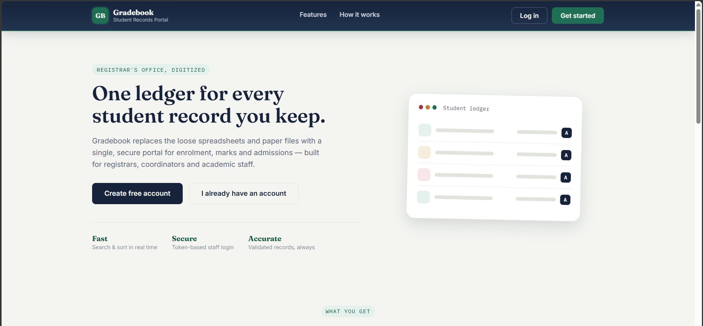

# 🎓 Gradebook — Student Management System

**A production-style, full-stack platform for managing student records** — secure JWT auth, live analytics, server-side search & pagination, and a fully containerized deployment.


**[Features](#-features) · [Architecture](#-architecture) · [Auth Flow](#-authentication-flow) · [Data Model](#-data-model) · [Quick Start](#-quick-start-docker) · [API Reference](#-api-reference) · [Screens](#-a-tour-of-the-app)**

</div>

<br>

> ### "One ledger for every student record you keep."
> Gradebook replaces loose spreadsheets and paper files with a single, secure portal for enrollment, marks, and admissions — built for registrars, coordinators, and academic staff.

<br>

## 🧭 Table of Contents

- [✨ Features](#-features)
- [🏗 Architecture](#-architecture)
- [🔐 Authentication Flow](#-authentication-flow)
- [🗃 Data Model](#-data-model)
- [🔄 Request Lifecycle](#-request-lifecycle)
- [🛠 Tech Stack](#-tech-stack)
- [🚀 Quick Start (Docker)](#-quick-start-docker)
- [💻 Manual Setup](#-manual-setup-without-docker)
- [🔑 Environment Variables](#-environment-variables)
- [📡 API Reference](#-api-reference)
- [📁 Project Structure](#-project-structure)
- [🖼 A Tour of the App](#-a-tour-of-the-app)
- [🗺 Roadmap](#-roadmap)
- [🤝 Contributing](#-contributing)

<br>

## ✨ Features

<table>
<tr>
<td width="33%" valign="top">

### 🔐 Security
- JWT-based register / login / logout
- BCrypt password hashing
- Stateless, filter-based auth
- Role-based accounts (`ADMIN` / `STAFF`)
- Self-service forgot/reset password

</td>
<td width="33%" valign="top">

### 🧑‍🎓 Student Management
- Full CRUD with server-side validation
- Keyword search across records
- Sortable, paginated listings
- Marks validated (0–100 range)

</td>
<td width="33%" valign="top">

### 📊 Insights & Ops
- Live overview dashboard (single-query stats)
- Per-course distribution breakdown
- Auto-seeded sample data on boot
- Swagger/OpenAPI docs built-in
- One-command Docker deployment

</td>
</tr>
</table>

<br>

## 🏗 Architecture

Three containers, one command. The Angular SPA is compiled and served as static assets by **nginx**, which also acts as the entry point; the Spring Boot API talks to Oracle over JDBC.

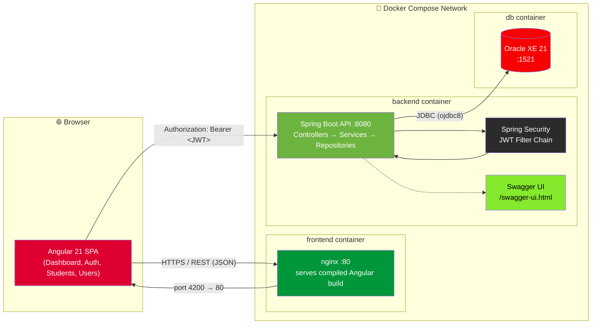

**Layered backend design:**

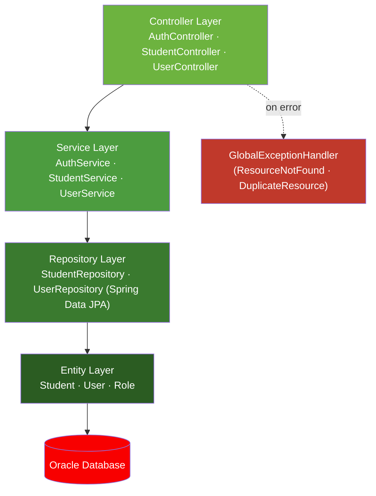

<br>

## 🔐 Authentication Flow

Every protected request passes through a single `OncePerRequestFilter` (`JwtAuthFilter`) that validates the token and populates Spring Security's context before the request ever reaches a controller.

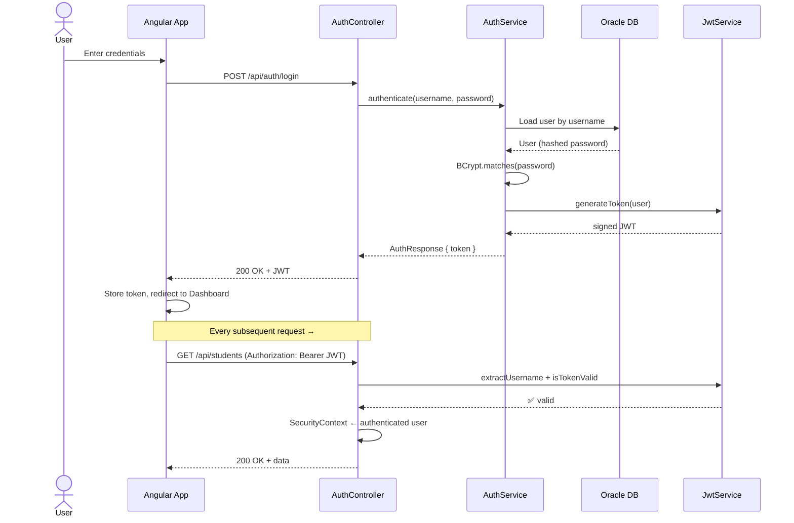

<details>
<summary><b>🔒 What makes this secure?</b> (click to expand)</summary>

<br>

- **Stateless sessions** — `SessionCreationPolicy.STATELESS`; no server-side session state, scales horizontally
- **Password hashing** — `BCryptPasswordEncoder`, never stored or returned in plaintext
- **Public vs. protected routes** — only `/api/auth/**`, `/actuator/**`, and `/swagger-ui/**` bypass the JWT filter; everything else requires a valid token
- **Fail-safe filter** — any exception during token parsing clears the security context, letting Spring's entry point return a clean `401`
- **DTO-level redaction** — `UserResponse` excludes the password field at the object level, not just via serialization filtering

</details>

<br>

## 🗃 Data Model

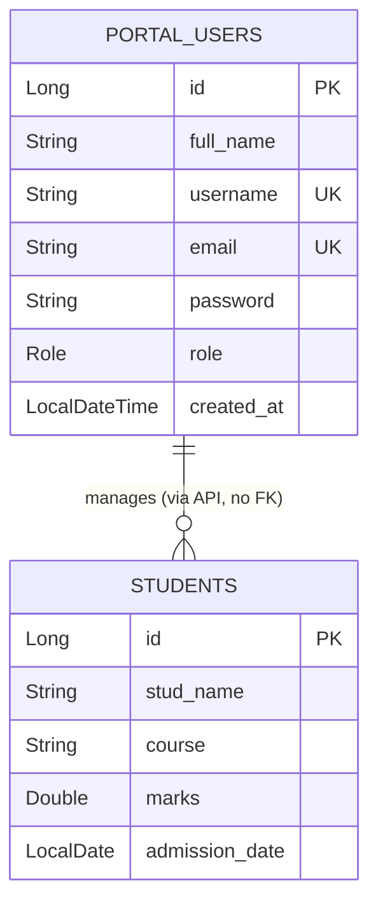

> `students` and `portal_users` are independent tables — `portal_users` represents staff accounts that *operate* the system (via JWT-authenticated API calls), not a foreign-key relationship to student records. Indexes on `stud_name`, `course`, `marks`, and `admission_date` keep list/search/sort queries fast as the roster grows.

<br>

## 🔄 Request Lifecycle

How a single "Add Student" action flows end-to-end:

```mermaid
flowchart LR
    A["📝 Fill form<br/>(addstudent component)"] --> B["Angular validates<br/>required fields, marks range"]
    B --> C["POST /api/students<br/>+ JWT header"]
    C --> D["JwtAuthFilter<br/>validates token"]
    D --> E["StudentController<br/>@Valid @RequestBody"]
    E --> F["StudentService<br/>business rules"]
    F --> G["StudentRepository<br/>JPA save()"]
    G --> H[("Oracle DB<br/>student_seq → INSERT")]
    H --> I["201 Created<br/>+ saved Student JSON"]
    I --> J["UI updates list<br/>+ Overview stats refresh"]

    style A fill:#DD0031,color:#fff
    style C fill:#DD0031,color:#fff
    style D fill:#2b2b2b,color:#fff
    style E fill:#6DB33F,color:#fff
    style F fill:#6DB33F,color:#fff
    style G fill:#6DB33F,color:#fff
    style H fill:#F80000,color:#fff
    style J fill:#DD0031,color:#fff
```

<br>

## 🛠 Tech Stack

<table>
<tr><th>Layer</th><th>Technology</th></tr>
<tr><td><b>Frontend</b></td><td>

  

</td></tr>
<tr><td><b>Backend</b></td><td>

  

</td></tr>
<tr><td><b>Auth</b></td><td>

 

</td></tr>
<tr><td><b>Database</b></td><td>


</td></tr>
<tr><td><b>Docs</b></td><td>


</td></tr>
<tr><td><b>DevOps</b></td><td>

 

</td></tr>
</table>

<br>

## 🚀 Quick Start (Docker)

The fastest path to a fully running stack — database, API, and UI — with **one command**.

```bash
git clone https://github.com/Manaswi-Nimje/StudentManagementSystem.git
cd StudentManagementSystem

cp .env.example .env
docker compose up --build
```

<div align="center">

| Service | URL |
|:---|:---|
| 🖥️ **Frontend** | http://localhost:4200 |
| 🔌 **Backend API** | http://localhost:8080 |
| 📑 **Swagger UI** | http://localhost:8080/swagger-ui.html |

</div>

> 💡 Sample data is auto-seeded on first boot — log in and explore immediately, no manual setup required.

<br>

## 💻 Manual Setup (Without Docker)

<details>
<summary><b>Click to expand step-by-step instructions</b></summary>

<br>

**Prerequisites:** [Java 17+](https://www.oracle.com/java/technologies/downloads/) & Maven · [Node.js 18+](https://nodejs.org/) & npm · [Angular CLI](https://angular.io/cli) · an Oracle Database instance

### 1. Backend
```bash
cd backend
mvn clean install
mvn spring-boot:run
```
API starts on `http://localhost:8080`

### 2. Frontend
```bash
cd frontend
npm install
ng serve
```
App available on `http://localhost:4200`

</details>

<br>

## 🔑 Environment Variables

Copy `.env.example` → `.env` and configure:

| Variable | Description | Default |
|---|---|---|
| `ORACLE_USERNAME` | Oracle database username | `studentapp` |
| `ORACLE_PASSWORD` | Oracle database password | `student123` |
| `JWT_SECRET` | Secret key used to sign JWT tokens | *dev placeholder — must be changed* |

> ⚠️ **Never use the default `JWT_SECRET` in production.** Generate a strong one with:
> ```bash
> openssl rand -base64 48
> ```

<br>

## 📡 API Reference

<details>
<summary><b>🔐 Auth — <code>/api/auth</code></b></summary>
<br>

| Method | Endpoint | Description |
|---|---|---|
| `POST` | `/api/auth/register` | Register a new user |
| `POST` | `/api/auth/login` | Authenticate and receive a JWT |
| `POST` | `/api/auth/forgot-password` | Request a password reset |
| `POST` | `/api/auth/reset-password` | Reset password using a reset token |

</details>

<details>
<summary><b>🧑‍🎓 Students — <code>/api/students</code></b></summary>
<br>

| Method | Endpoint | Description |
|---|---|---|
| `POST` | `/api/students` | Add a new student |
| `GET` | `/api/students?page=&size=&sortBy=&direction=` | List students (paginated & sorted) |
| `GET` | `/api/students/{id}` | Get a student by ID |
| `PUT` | `/api/students/{id}` | Update a student |
| `DELETE` | `/api/students/{id}` | Delete a student |
| `GET` | `/api/students/stats` | Overview stats — totals, average marks, top performers, per-course breakdown |
| `GET` | `/api/students/search?keyword=&page=&size=` | Search students by keyword |

**Student record schema:**

| Field | Type | Validation |
|---|---|---|
| `studName` | String | Required |
| `course` | String | Required |
| `marks` | Double | Required, 0–100 |
| `admissionDate` | Date | Required |

</details>

<details>
<summary><b>👥 Users — <code>/api/users</code></b></summary>
<br>

| Method | Endpoint | Description |
|---|---|---|
| `GET` | `/api/users?page=&size=&sortBy=&direction=` | Paginated directory of all accounts (passwords never exposed) |

</details>

> 📑 Full request/response schemas and try-it-out testing: **Swagger UI** at `/swagger-ui.html` once the backend is running.

<br>

## 📁 Project Structure

```
StudentManagementSystem/
├── backend/
│   ├── src/main/java/com/studentapp/studentmanagement/
│   │   ├── config/          # CORS config, startup data seeding
│   │   ├── controller/      # Auth, Student, User REST controllers
│   │   ├── dto/             # Request/response payloads
│   │   ├── entity/          # Student, User, Role
│   │   ├── exception/       # Global exception handling
│   │   ├── repository/      # Spring Data JPA repositories
│   │   ├── security/        # JWT filter, JWT service, security config
│   │   └── service/         # Business logic layer
│   └── Dockerfile
│
├── frontend/
│   ├── src/app/
│   │   ├── landing/         # Public landing page
│   │   ├── login/ register/ forgot-password/
│   │   ├── auth/            # Route guards
│   │   ├── dashboard/       # Authenticated app shell
│   │   ├── overview/        # Analytics dashboard
│   │   ├── studentlist/     # Student list, search & pagination
│   │   ├── addstudent/      # Add/edit student form
│   │   ├── users/           # Account directory
│   │   └── profile/         # Profile lookup
│   └── Dockerfile
│
├── ScreenShots/
├── docker-compose.yml
├── .env.example
└── README.md
```

<br>

## 🖼 A Tour of the App

<table>
<tr>
<td width="50%">

<p align="center"><b>Landing Page</b><br/><sub>Public-facing intro and CTA</sub></p>
</td>
<td width="50%">
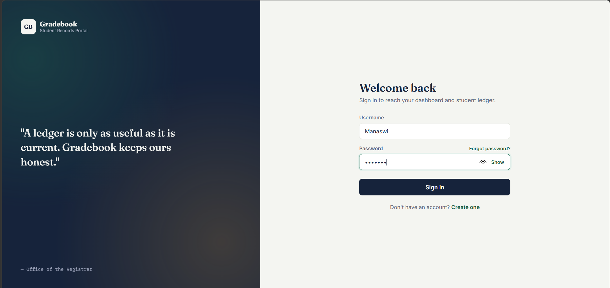
<p align="center"><b>Secure Login</b><br/><sub>JWT-authenticated sign-in</sub></p>
</td>
</tr>
<tr>
<td width="50%">
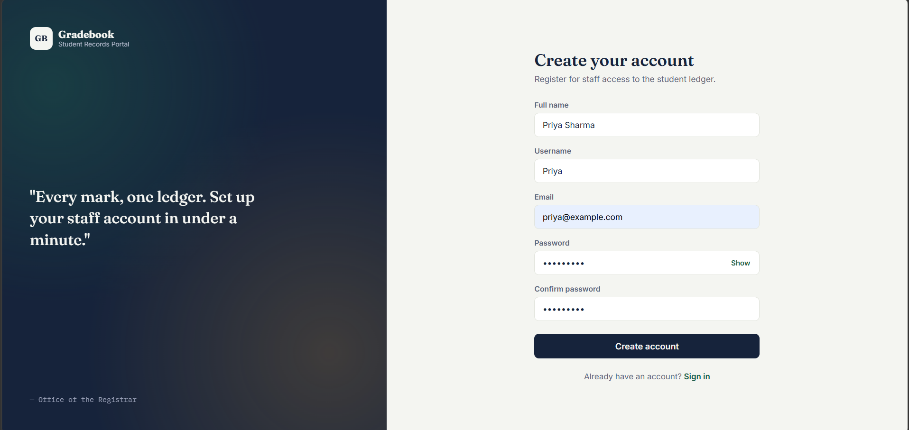
<p align="center"><b>Registration</b><br/><sub>New staff account creation</sub></p>
</td>
<td width="50%">
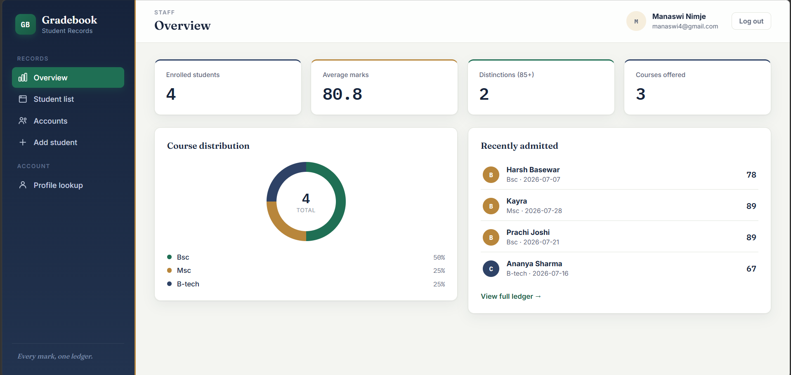
<p align="center"><b>Overview Dashboard</b><br/><sub>Live stats: totals, averages, course mix</sub></p>
</td>
</tr>
<tr>
<td width="50%">
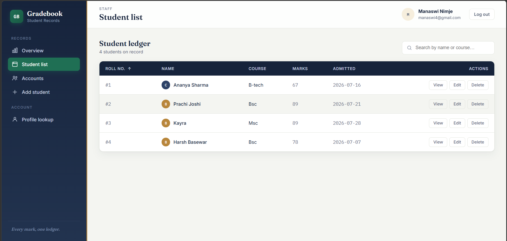
<p align="center"><b>Student List</b><br/><sub>Search, sort & paginate records</sub></p>
</td>
<td width="50%">
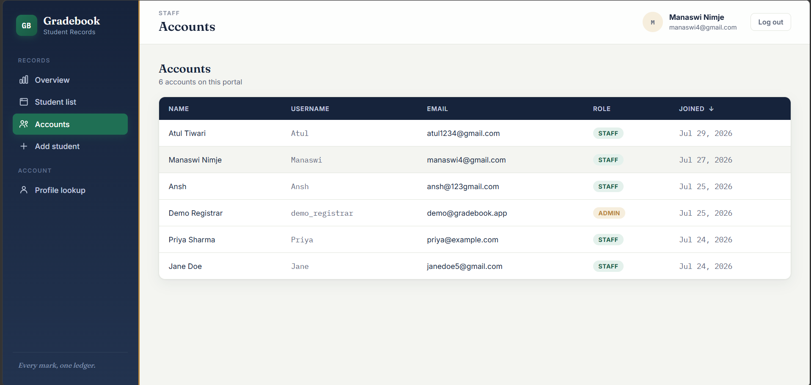
<p align="center"><b>Account Directory</b><br/><sub>Role-based user management</sub></p>
</td>
</tr>
<tr>
<td width="50%">
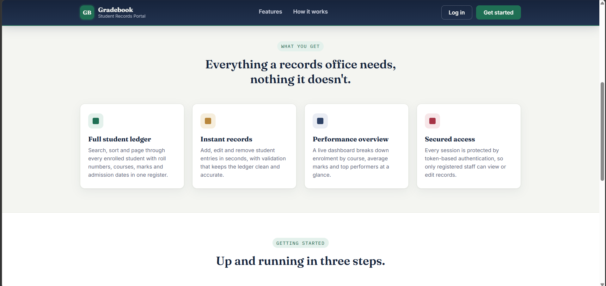
<p align="center"><b>Features Section</b><br/><sub>What the platform offers, at a glance</sub></p>
</td>
<td width="50%">
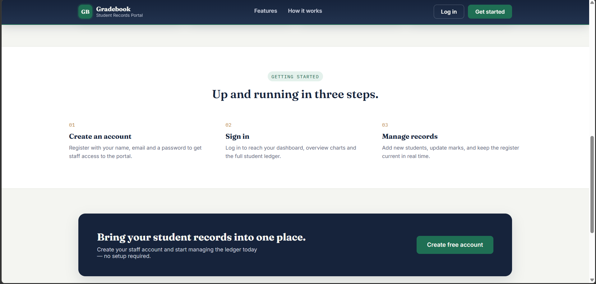
<p align="center"><b>How It Works</b><br/><sub>Guided onboarding on the landing page</sub></p>
</td>
</tr>
</table>

<br>

## 🗺 Roadmap

- [ ] Role-based UI permissions (Admin vs. Staff views)
- [ ] Bulk import/export of student records (CSV)
- [ ] Automated test coverage (JUnit + Angular unit tests)
- [ ] CI/CD pipeline via GitHub Actions
- [ ] Cloud deployment (Render / AWS / Azure)

<br>

## 🤝 Contributing

Contributions, issues, and feature requests are welcome!

```bash
git checkout -b feature/your-feature-name
git commit -m "Add: your feature description"
git push origin feature/your-feature-name
```

Then open a pull request. 🎉

<br>

## 📄 License

Licensed under the **MIT License** — free to use, modify, and distribute.

---

<div align="center">

**Made by [Manaswi Nimje](https://github.com/Manaswi-Nimje)**

⭐ If this project helped you, consider giving it a star!

</div>
